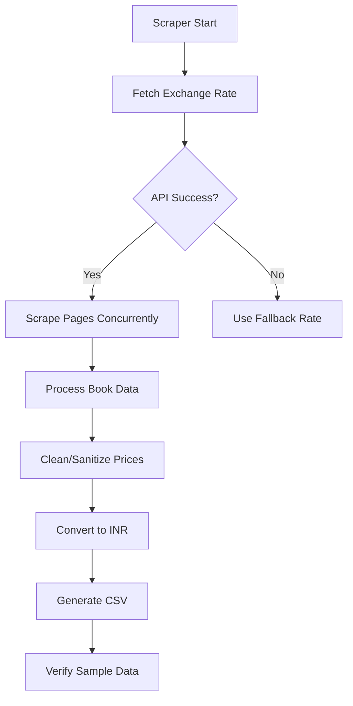

## 📚 Book Price Scraper with Real-Time Currency Conversion 💹


A high-performance ⚡ Python web scraper that extracts book data from [books.toscrape.com](http://books.toscrape.com) with **real-time GBP to INR conversion** using exchange rate APIs.

## 🌟 Key Features

| Feature | Technology Used | Benefit |
|---------|----------------|---------|
| **Multi-threaded scraping** 🚀 | `concurrent.futures.ThreadPoolExecutor` | 5x faster scraping |
| **Live currency conversion** 💱 | ExchangeRate-API v6 | Accurate ₹ prices |
| **Data sanitization** 🧹 | Custom `clean_price()` function | Handles special chars (Â, £) |
| **Error resilience** 🛡️ | Exponential backoff retries | Survives network issues |
| **CSV export** 📊 | Python `csv.DictWriter` | Excel-ready formatting |
| **Progress tracking** 🔍 | Real-time console updates | Visual scraping status |

## 🛠️ System Architecture



## 🔧 Installation Guide

### Prerequisites
- Python 3.8+
- Pip package manager

### Step-by-Step Setup
```bash
# Clone repository
git clone https://github.com/yourusername/book-price-scraper.git
cd book-price-scraper

# Create virtual environment (recommended)
python -m venv venv
source venv/bin/activate  # Linux/Mac
venv\Scripts\activate     # Windows

# Install dependencies
pip install -r requirements.txt
```
[](https://github.com/vijaysimhaa/yourrepo/releases/latest/download/requirements.txt)

### Configuration
1. Get API key from [ExchangeRate-API](https://www.exchangerate-api.com/)
2. Update `config.py`:
```python
EXCHANGE_API_URL = "https://v6.exchangerate-api.com/v6/PutYourExchangeAPIHere/latest/GBP"
MAX_PAGES = 10       # Pages to scrape (50 books/page)
MAX_WORKERS = 5      # Optimal for most systems
REQUEST_TIMEOUT = 10 # Seconds before timeout
```

## 🚀 Usage Instructions

### Basic Execution
```bash
python scraper.py
```

### Expected Output
```
🔄 [1/3] Fetching GBP→INR exchange rate...
💱 Current rate: £1 = ₹112.68 (Source: ExchangeRate-API)

🔍 [2/3] Scraping pages...
📊 Page 1: 20 books processed (3.2s)
📊 Page 2: 20 books processed (6.1s)
...
✅ [3/3] Completed in 14.8s!
💾 Data saved to: books_data_20240515.csv
📝 Sample record verified ✔️
```

### Advanced Options
```bash
# Scrape specific page range
python scraper.py --start 5 --end 8

# Custom output file
python scraper.py --output custom_data.csv
```

## 📊 Data Output Specification

### CSV Structure
```csv
Title,Price (£),Price (₹),Availability,Rating,Product_URL,Page,Exchange_Rate
"A Light in the Attic",£51.77,"₹5,833.86","In stock","Three","http://...",1,"£1=₹112.68"
```

### Field Details
| Column | Type | Description | Validation |
|--------|------|-------------|------------|
| `Title` | String | Full book title | Max 255 chars |
| `Price (£)` | Currency | Original GBP price | Regex: `^£\d+\.\d{2}$` |
| `Price (₹)` | Currency | Converted INR value | Formatted with commas |
| `Availability` | String | Stock status | ["In stock", "Out of stock"] |
| `Rating` | String | 1-5 star rating | ["One", "Two", ..., "Five"] |
| `Product_URL` | URL | Direct book link | Valid HTTP URL |
| `Exchange_Rate` | String | Rate used for conversion | Format: "£1=₹XXX.XX" |

## 🛠️ Troubleshooting Guide

### Common Issues
| Error | Solution |
|-------|----------|
| `Â character in prices` | Update to v1.2+ with `clean_price()` function |
| `API rate limits` | Reduce `MAX_WORKERS` or wait 1 hour |
| `Incomplete CSV` | Check network stability, increase `REQUEST_TIMEOUT` |

### Debug Mode
```bash
python scraper.py --debug
```
Outputs raw HTML samples when errors occur.

## 🤝 Contribution Guidelines

1. Fork the repository
2. Create feature branch (`git checkout -b feature/AmazingFeature`)
3. Commit changes (`git commit -m 'Add amazing feature'`)
4. Push to branch (`git push origin feature/AmazingFeature`)
5. Open Pull Request

## 📜 License

MIT License - See [LICENSE.md](LICENSE.md) for details.

---

Made with ❤️ by Team VYM | 🔗 [Project Wiki](https://github.com/vijaysimhaa/book-price-scraper/wiki) | 🐛 [Report Issues](https://github.com/yourusername/book-price-scraper/issues)
```
